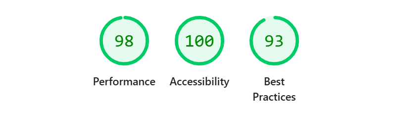

# Analyze Words

Веб-приложение для анализа текста с различными метриками и статистикой.



## Описание

Analyze Words — это простое веб-приложение, которое позволяет анализировать введенный текст и получать подробную статистику о нем. Приложение предоставляет следующие метрики:

- **Первый символ** — первый символ введенного текста
- **Количество слов** — общее число слов в тексте
- **Количество символов** — общее число символов в тексте
- **Самое длинное слово** — слово с максимальной длиной
- **Обращенный текст** — текст, записанный в обратном порядке
- **Количество предложений** — число предложений в тексте
- **Количество уникальных слов** — число уникальных слов
- **Слова в алфавитном порядке** — список всех слов, отсортированных по алфавиту

## Технологии

- **JavaScript** (ES6+)
- **Vite** — инструмент для сборки и разработки
- **ESLint** — линтер для JavaScript
- **Stylelint** — линтер для CSS
- **JSDoc** — генератор документации

## Требования

- Node.js >= 16
- npm >= 8

## Установка

1. Клонируйте репозиторий или скачайте проект
2. Установите зависимости:

```bash
npm install
```

## Использование

### Режим разработки

Запустите сервер разработки:

```bash
npm run dev
```

Приложение будет доступно по адресу, указанному в терминале (обычно `http://localhost:5173`).

Собранные файлы будут находиться в папке `dist`.

## Доступные команды

- `npm run dev` — запуск сервера разработки
- `npm run build` — сборка проекта для production
- `npm run lint` — проверка JavaScript кода линтером
- `npm run lint:fix` — автоматическое исправление ошибок линтера
- `npm run stylelint` — проверка CSS кода линтером
- `npm run stylelint:fix` — автоматическое исправление ошибок stylelint
- `npm test` — запуск тестов
- `npm run docs` — генерация документации с помощью JSDoc

## Структура проекта

```
analyze-words/
├── src/
│   ├── css/
│   │   └── style.css          # Стили приложения
│   ├── js/
│   │   └── index.js           # Основной JavaScript файл
│   └── libs/
│       └── __tests__/
│           └── index.test.js  # Тесты
├── index.html                 # HTML разметка
├── package.json               # Зависимости и скрипты
├── jest.config.js             # Конфигурация Jest
├── jest.setup.js              # Настройки Jest
└── jsdoc.json                 # Конфигурация JSDoc
```
